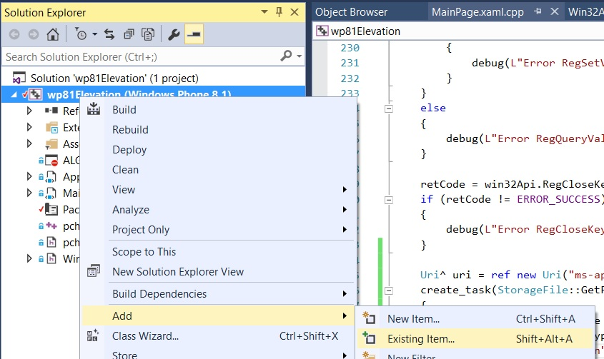
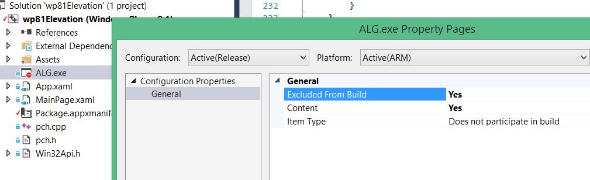
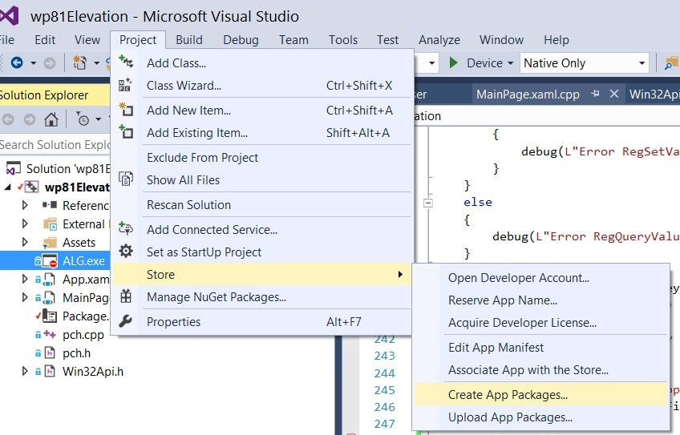
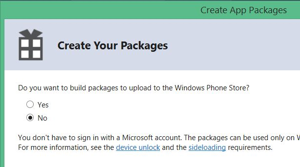

# wp81Elevation
Install a little web server running as a service on a Windows Phone 8.1

## Features

Currently, only 4 actions are possible (note: the phone IP address is displayed by the application) :

- Get the status of the service
```
GET http://<phone IP address>:7171/status
```
Returns HTTP 200 and `{"status":"OK"}` when the service is running.
- Execute a program
```
POST http://<phone IP address>:7171/execute
body: 
{
  "command":"<path to an executable file and its parameters>",
  (optional)"resultType":"(default)TEXT|JSON"
}
```
The program is executed by user system with high integrity and all privileges enabled.  
This action waits the end of the execution before returning.  
And the response contains the console output of the executed program.  
Example of usage: `{"command":"C:\windows\system32\WPR.EXE -status"}`  
By default the result of the exe is assumed to be of type TEXT, but if the result is already of type JSON you can add the optional property `resultType=JSON`.
- Download a file
```
GET http://<phone IP address>:7171/download?path=<path to a file>
```
Example of usage: `http://192.168.1.28:7171/download?path=C:\Data\USERS\Public\Documents\wp81service.log`
- Stop the service
```
GET or POST http://<phone IP address>:7171/stopService
```
Could be useful to update the .exe of the service.

## Miscellaneous

The service writes all its logs into `C:\Data\USERS\Public\Documents\wp81service.log`. 

The service also writes OutputDebugString information coming from other processes into this log file: `C:\Data\USERS\Public\Documents\wp81service_debug.log`

All log files are overriden when the service starts.

In order to authorize a .exe to be executed by user `system`, the .exe must be added to the value `Executables` of the key `SOFTWARE\Microsoft\SecurityManager\PrincipalClasses\PRINCIPAL_CLASS_TCB` of the registry hive `HKEY_LOCAL_MACHINE`.

Compilation requires Visual Studio 2015 with Windows Phone 8.1 support.

Execution requires a Windows Phone 8.1 rooted with [WPinternals](https://github.com/ReneLergner/WPinternals).

## Included programs

- WP81LISTPROCESS.EXE *\<no parameter\>*  
List all the running processes with a list of their privileges.  
The result is a JSON.

- WP81LISTOBJECT.EXE *\<directory\>*  
List the objects contained in a directory of the Object Manager.

Examples of usages:  
```
curl -v http://192.168.1.18:7171/execute -d "{\"command\":\"C:\\windows\\system32\\WP81LISTOBJECT.EXE \\Device\"}"  
curl -v http://192.168.1.18:7171/execute -d "{\"command\":\"C:\\windows\\system32\\WP81LISTOBJECT.EXE \\Driver\"}"  
curl -v http://192.168.1.18:7171/execute -d "{\"command\":\"C:\\windows\\system32\\WP81LISTOBJECT.EXE \\GLOBAL??\"}"  
```

- WP81LISTDEVNODE.EXE *\<no parameter\>*  
List the device instances that are currently present on the system.

- WP81SERVICECTRL.EXE *\<command\>*  
List the driver services. Can also stop a driver service.

Examples of usages:  
```
curl -v http://192.168.1.18:7171/execute -d "{\"command\":\"C:\\windows\\system32\\WP81SERVICECTRL.EXE list\"}"  
curl -v http://192.168.1.18:7171/execute -d "{\"command\":\"C:\\windows\\system32\\WP81SERVICECTRL.EXE stop wp81debuglogger\"}"  
```  

## How to add a file into a .apx and build the package.










## Credits

[JSON read/write](https://github.com/DaveGamble/cJSON)

[System token creation](https://github.com/hatRiot/token-priv/blob/master/poptoke/poptoke/SeCreateTokenPrivilege.cpp)

[Winsock2 server](https://www.winsocketdotnetworkprogramming.com/winsock2programming/winsock2advancedcode1c.html)

[DLL import](https://github.com/tandasat/SecRuntimeSample)
