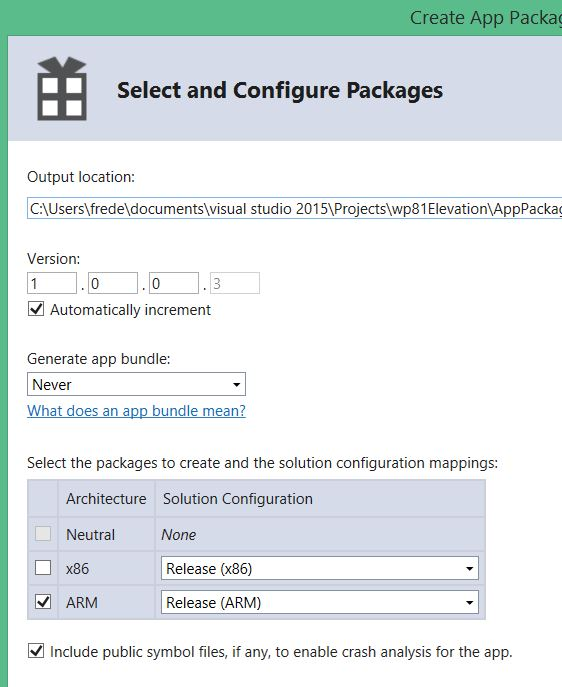

# wp81Elevation
Install a little web server running as a service on a Windows Phone 8.1

Currently, only 4 actions are possible:

- Get the status of the service
```
GET http://\<phone IP address\>:7171/status
```
Returns HTTP 200 and `{"status":"OK"}` when the service is running.
- Execute a program
```
POST http://\<phone IP address\>:7171/execute
body: {"command":"\<path to an executable file and its parameters\>"}
```
The program is executed by user system with high integrity and all privileges enabled.  
This action waits the complete execution of the program before returning.  
And the response contains the console output of the executed program.  
Example of usage: `{"command":"C:\windows\system32\WPR.EXE -status"}`
- Download a file
```
GET http://\<phone IP address\>:7171/download?path=\<path to a file\>
```
Example of usage: `http://192.168.1.28:7171/download?path=C:\Data\USERS\Public\Documents\wp81service.log`
- Stop the service
```
GET or POST http://\<phone IP address\>:7171/stopService
```
Could be useful to update the .exe of the service.

The service writes all its logs into `C:\Data\USERS\Public\Documents\wp81service.log`. This file is overriden when the service starts.

In order to authorize a .exe to be executed by user `system`, the .exe must be added to the value `Executables` of the key `SOFTWARE\Microsoft\SecurityManager\PrincipalClasses\PRINCIPAL_CLASS_TCB` of the registry hive `HKEY_LOCAL_MACHINE`.

Compilation requires Visual Studio 2015 with Windows Phone 8.1 support.

Execution requires a Windows Phone 8.1 rooted with [WPinternals](https://github.com/ReneLergner/WPinternals).

## How to add a file into a .apx and build the package.




